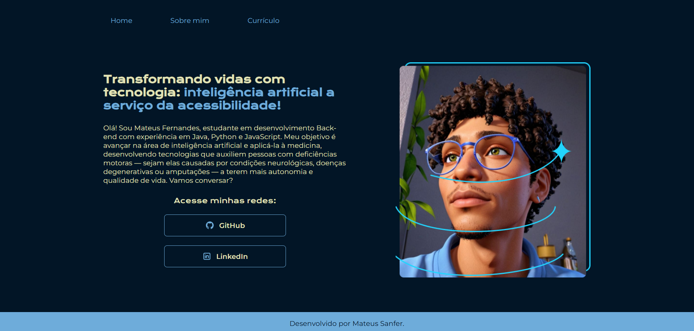

# Olá, Bem vindo ao meu projeto de portfólio
## Desenvolvido com base das aulas do Curso Iniciante em Programação G8 - ONE, que é uma parceria Oracle com a Alura.

## Ferramentas utilizadas:

* HTML

* CSS

* Flex-box
 
## Veja você mesmo no link:

https://portfolio-ha3tt5tbb-mateus-sanfers-projects.vercel.app/

## 🧑🏾‍💻 Feito por:

| [ Mateus Sanfer](https://github.com/MateusSanfer) | 
| :---: | 

---
### Meu Linkedin: https://www.linkedin.com/in/mateus-sanfer/
### Linkedin Alura: https://www.linkedin.com/school/aluracursos/
