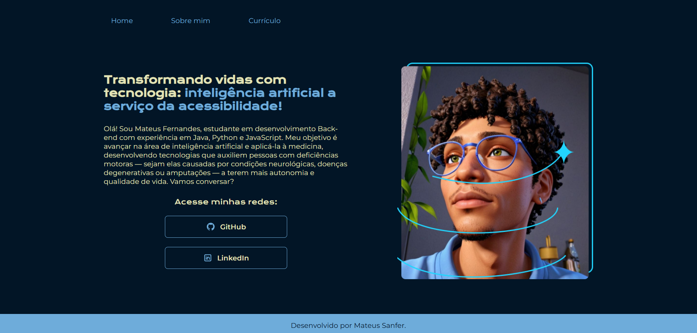

# Olá, Bem vindo ao meu projeto de portfólio!

Este é um projeto de portfólio desenvolvido para apresentar minhas habilidades e projetos como desenvolvedor. Aqui você encontrará informações sobre as tecnologias que utilizo, exemplos de trabalhos realizados e links para contato profissional. Sinta-se à vontade para explorar e conhecer mais sobre meu trabalho!

## Ferramentas utilizadas:

* React
* Tailwind CSS
 
## Veja você mesmo no link:

https://mateussanfer.netlify.app/

## 🧑🏾‍💻 Feito por:

| [ Mateus Sanfer](https://github.com/MateusSanfer) | 
| :---: | 

---
### Meu Linkedin: https://www.linkedin.com/in/mateus-sanfer/

